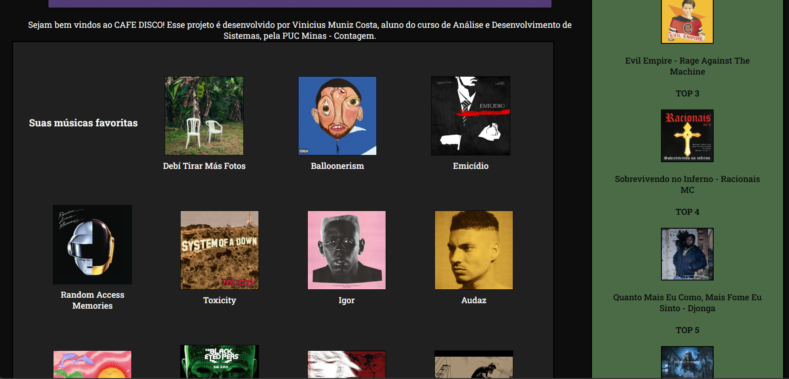
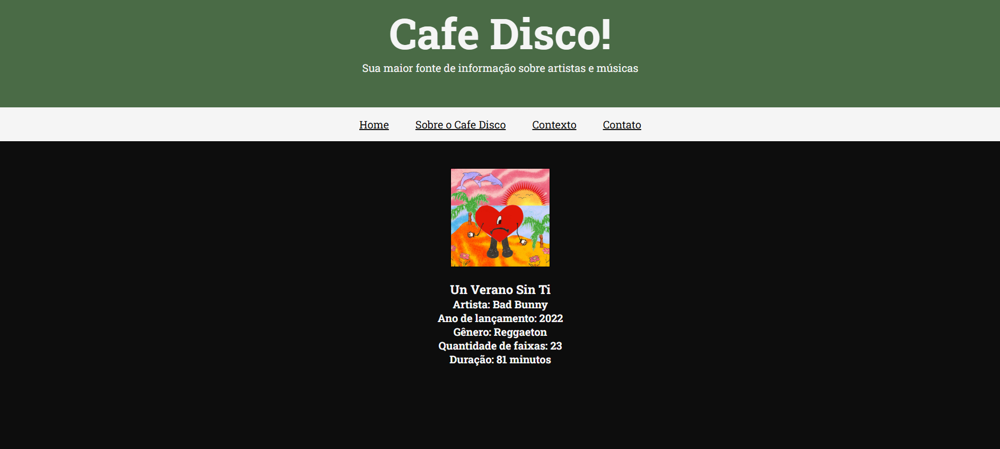

[](https://classroom.github.com/a/KZhXwLZL)
[](https://classroom.github.com/open-in-codespaces?assignment_repo_id=20650337)
# Trabalho Prático 05 - Semanas 7 e 8

**Páginas de detalhes dinâmicas**

Nessa etapa, vamos evoluir o trabalho anterior, acrescentando a página de detalhes, conforme o  projeto escolhido. Imagine que a página principal (home-page) mostre um visão dos vários itens que existem no seu site. Ao clicar em um item, você é direcionado pra a página de detalhes. A página de detalhe vai mostrar todas as informações sobre o item do seu projeto. seja esse item uma notícia, filme, receita, lugar turístico ou evento.

Leia o enunciado completo no Canvas. 

**IMPORTANTE:** Assim como informado anteriormente, capriche na etapa pois você vai precisar dessa parte para as próximas semanas. 

**IMPORTANTE:** Você deve trabalhar e alterar apenas arquivos dentro da pasta **`public`,** mantendo os arquivos **`index.html`**, **`styles.css`** e **`app.js`** com estes nomes, conforme enunciado. Deixe todos os demais arquivos e pastas desse repositório inalterados. **PRESTE MUITA ATENÇÃO NISSO.**

## Informações Gerais

- Nome: **Vinícius Muniz Costa**
- Matricula: **884750**
- Proposta de projeto escolhida: **Artistas e álbuns**
- Breve descrição sobre seu projeto: **O site CAFE DISCO traz as maiores e mais detalhadas informações sobre o universo musical!**

## Print da Home-Page



## Print da página de detalhes do item



## Cole aqui abaixo a estrutura JSON utilizada no app.js


const dados = [

    
        {
            "id": 1,
            "album": "Debí Tirar Más Fotos",
            "artista": "Bad Bunny",
            "ano": 2025,
            "genero": "Reggaeton",
            "qntfaixas": 17,
            "duracao": 62,
            "imagem": "imgs/dtmf.jpg"
        },

        {
            "id": 2,
            "album": "Balloonerism",
            "artista": "Mac Miller",
            "ano": 2025,
            "genero": "Neo-soul",
            "qntfaixas": 14,
            "duracao": 58,
            "imagem": "imgs/balloonerism.jpg"
        },

        {
            "id": 3,
            "album": "Emicídio",
            "artista": "Emicida",
            "ano": 2010,
            "genero": "Hip-hop",
            "qntfaixas": 18,
            "duracao": 58,
            "imagem": "imgs/emicidio.jpg"
        },

        {
            "id": 4,
            "album": "Random Access Memories",
            "artista": "Daft Punk",
            "ano": 2013,
            "genero": "Disco",
            "qntfaixas": 13,
            "duracao": 74,
            "imagem": "imgs/ram.jpg"
        },

        {
            "id": 5,
            "album": "Toxicity",
            "artista": "System Of A Down",
            "ano": 2001,
            "genero": "Rock",
            "qntfaixas": 15,
            "duracao": 44,
            "imagem": "imgs/toxicity.jpg"
        },

        {
            "id": 6,
            "album": "Igor",
            "artista": "Tyler, The Creator",
            "ano": 2019,
            "genero": "R&B",
            "qntfaixas": 12,
            "duracao": 39,
            "imagem": "imgs/igor.jpg"
        },

        {
            "id": 7,
            "album": "Audaz",
            "artista": "Filipe Ret",
            "ano": 2018,
            "genero": "Rap",
            "qntfaixas": 13,
            "duracao": 51,
            "imagem": "imgs/audaz.jpg"
        },

        {
            "id": 8,
            "album": "Un Verano Sin Ti",
            "artista": "Bad Bunny",
            "ano": 2022,
            "genero": "Reggaeton",
            "qntfaixas": 23,
            "duracao": 81,
            "imagem": "imgs/unveranosinti.jpg"
        },
    
        
        {
            "id": 9,
            "album": "The E.N.D (The Energy Never Dies)",
            "artista": "Black Eyed Peas",
            "ano": 2009,
            "genero": "Eletrônica",
            "qntfaixas": 25,
            "duracao": 103,
            "imagem": "imgs/theend.png"
        },

            {
            "id": 10,
            "album": "Acústico - MTV",
            "artista": "Charlie Brown Jr",
            "ano": 2003,
            "genero": "Rock",
            "qntfaixas": 20,
            "duracao": 70,
            "imagem": "imgs/acusticocbjr.jpg"
        },

        {
            "id": 11,
            "album": "Meteora",
            "artista": "Linkin Park",
            "ano": 2003,
            "genero": "Rock",
            "qntfaixas": 13,
            "duracao": 36,
            "imagem": "imgs/meteora.jpg"
        },

        {
            "id": 12,
            "album": "Hybrid Theory",
            "artista": "Linkin Park",
            "ano": 2000,
            "genero": "Rock",
            "qntfaixas": 15,
            "duracao": 49,
            "imagem": "imgs/hybridtheory.jpg"
        },

        {
            "id": 13,
            "album": "Blonde",
            "artista": "Frank Ocean",
            "ano": 2016,
            "genero": "R&B",
            "qntfaixas": 17,
            "duracao": 60,
            "imagem": "imgs/blonde.jpg"
        },

        {
            "id": 14,
            "album": "estandarte",
            "artista": "Skank",
            "ano": 2008,
            "genero": "Rock",
            "qntfaixas": 12,
            "duracao": 53,
            "imagem": "imgs/estandarte.jpg"
        },

        {
            "id": 15,
            "album": "American Idiot",
            "artista": "Green Day",
            "ano": 2004,
            "genero": "Rock",
            "qntfaixas": 9,
            "duracao": 57,
            "imagem": "imgs/americanidiot.jpg"
        },

        {
            "id": 16,
            "album": "Eu Não Sou Santo",
            "artista": "Bezerra da Silva",
            "ano": 1990,
            "genero": "Samba",
            "qntfaixas": 12,
            "duracao": 40,
            "imagem": "imgs/eunaosousanto.jpg"
        },
        
        {
            "id": 17,
            "album": "Thriller",
            "artista": "Michael Jackson",
            "ano": 1982,
            "genero": "Pop",
            "qntfaixas": 9,
            "duracao": 42,
            "imagem": "imgs/thriller.jpg"
        },

        {
            "id": 18,
            "album": "Raise!",
            "artista": "Earth, Wind & Fire",
            "ano": 1981,
            "genero": "Disco",
            "qntfaixas": 9,
            "duracao": 38,
            "imagem": "imgs/raise.jpg"
        },

        {
            "id": 19,
            "album": "Clube da Esquina",
            "artista": "Milton Nascimento - Lô Borges",
            "ano": 1972,
            "genero": "MPB",
            "qntfaixas": 21,
            "duracao": 64,
            "imagem": "imgs/clubedaesquina.jpg"
        },

        {
            "id": 20,
            "album": "MOR, No Le Temas a La Oscuridad",
            "artista": "Feid",
            "ano": 2023,
            "genero": "Reggaeton",
            "qntfaixas": 16,
            "duracao": 44,
            "imagem": "imgs/mor.jpg"
        },

        {
            "id": 21,
            "album": "Racional Vol. 1",
            "artista": "Tim Maia",
            "ano": 1975,
            "genero": "MPB",
            "qntfaixas": 9,
            "duracao": 33,
            "imagem": "imgs/racional.jpg"
        },

        {
            "id": 22,
            "album": "No Need To Argue",
            "artista": "The Cranberries",
            "ano": 1994,
            "genero": "Rock Alternativo",
            "qntfaixas": 13,
            "duracao": 50,
            "imagem": "imgs/noneedtoargue.jpg"
        },

        {
            "id": 23,
            "album": "Exodus",
            "artista": "Bob Marley & The Wailers",
            "ano": 1977,
            "genero": "Reggae",
            "qntfaixas": 10,
            "duracao": 37,
            "imagem": "imgs/exodus.jpg"
        },

        {
            "id": 24,
            "album": "Illmatic",
            "artista": "Nas",
            "ano": 1994,
            "genero": "Hip-Hop",
            "qntfaixas": 10,
            "duracao": 39,
            "imagem": "imgs/illmatic.jpg"
        },
        
       {
            "id": 25,
            "album": "2014 Forest Hills Drive",
            "artista": "J. Cole",
            "ano": 2014,
            "genero": "Rap",
            "qntfaixas": 13,
            "duracao": 64,
            "imagem": "imgs/2014fhd.jpg"
        },

        {
            "id": 26,
            "album": "Awaken, My Love!",
            "artista": "Childish Gambino",
            "ano": 2016,
            "genero": "Soul",
            "qntfaixas": 11,
            "duracao": 48,
            "imagem": "imgs/awakenmylove.jpg"
        },

        {
            "id": 27,
            "album": "To Pimp A Butterfly",
            "artista": "Kendrick Lamar",
            "ano": 2015,
            "genero": "Rap",
            "qntfaixas": 16,
            "duracao": 78,
            "imagem": "imgs/topimp.jpg"
        },

        {
            "id": 28,
            "album": "ANTI",
            "artista": "Rihanna",
            "ano": 2016,
            "genero": "Pop",
            "qntfaixas": 16,
            "duracao": 50,
            "imagem": "imgs/anti.jpg"
        },

        {
            "id": 29,
            "album": "Views",
            "artista": "Drake",
            "ano": 2016,
            "genero": "Rap",
            "qntfaixas": 20,
            "duracao": 81,
            "imagem": "imgs/views.jpg"
        },

        {
            "id": 30,
            "album": "Cheshire Cat",
            "artista": "Blink-182",
            "ano": 1995,
            "genero": "Punk",
            "qntfaixas": 16,
            "duracao": 41,
            "imagem": "imgs/cheshirecat.jpg"
        },

        {
            "id": 31,
            "album": "Aquemini",
            "artista": "Outkast",
            "ano": 1998,
            "genero": "Rap",
            "qntfaixas": 16,
            "duracao": 74,
            "imagem": "imgs/aquemini.jpg"
        },

        {
            "id": 32,
            "album": "Born Sinner",
            "artista": "J. Cole",
            "ano": 2013,
            "genero": "Rap",
            "qntfaixas": 21,
            "duracao": 78,
            "imagem": "imgs/bornsinner.jpg"
        },
        
        {
            "id": 33,
            "album": "Pra Quem Já Mordeu Cachorro Por Comida, Até Que Eu Cheguei Longe",
            "artista": "Emicida",
            "ano": 2009,
            "genero": "Hip-Hop",
            "qntfaixas": 25,
            "duracao": 78,
            "imagem": "imgs/pqjccpcaqecl.jpg"
        },

        {
            "id": 34,
            "album": "Evil Empire",
            "artista": "Rage Against The Machine",
            "ano": 1996,
            "genero": "Rock",
            "qntfaixas": 11,
            "duracao": 46,
            "imagem": "imgs/evilempire.jpg"
        },

        {
            "id": 35,
            "album": "Sobrevivendo no Inferno",
            "artista": "Racionais M.C",
            "ano": 1997,
            "genero": "Hip-Hop",
            "qntfaixas": 12,
            "duracao": 73,
            "imagem": "imgs/sobrevivendonoinferno.jpg"
        },

        {
            "id": 36,
            "album": "Quanto Mais Eu Como, Mais Fome Eu Sinto!",
            "artista": "Djonga",
            "ano": 2025,
            "genero": "Rap",
            "qntfaixas": 12,
            "duracao": 42,
            "imagem": "imgs/qmecmfes.jpg"
        },

        {
            "id": 37,
            "album": "Nightmare",
            "artista": "Avenged Sevenfold",
            "ano": 2010,
            "genero": "Rock",
            "qntfaixas": 11,
            "duracao": 66,
            "imagem": "imgs/nightmare.jpg"
        }
]
        

    


```